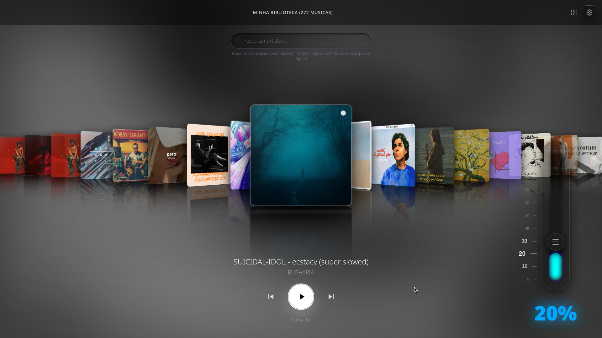
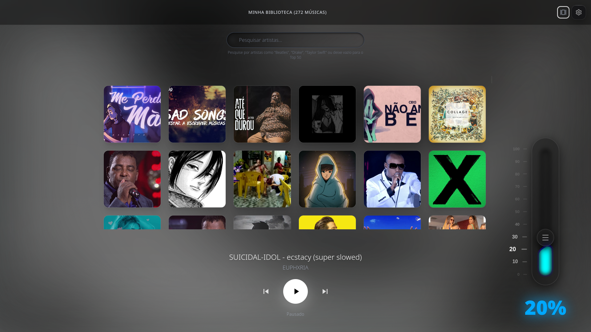
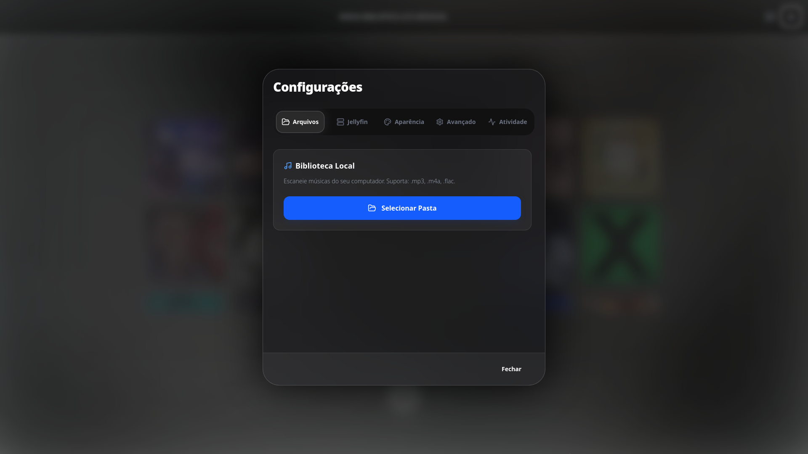

# Vynora 🎶


Vynora é um player de música construído com Electron, inspirado no iTunes CoverFlow

## 🚀 Funcionalidades

- **Visualizador Mercúrio**: Animações de volume dinâmicas com efeito de mercúrio líquido.
- **Integração API**: Busca automática de capas para suas músicas.
- **Cache**: Capas são extraídas dos metadados locais ou salvas em disco para carregamento.
- **Multiplataforma**: Suporte Linux (AppImage, deb, pacman), Windows e macOS.
- **Tema**: modo escuro e micro-interações suaves com Framer Motion.

## 📸 Screenshots

<p align="center">
  
  
  
</p>

## 🛠️ Como Instalar (Arch Linux)

Se você estiver no Arch Linux, pode buildar e instalar diretamente usando o PKGBUILD:

```bash
makepkg -si
```

Para outras plataformas, verifique a pasta `dist-electron` após rodar o build.

## 📦 Desenvolvimento

```bash
# Instalar dependências
npm install

# Rodar em modo de desenvolvimento
npm run electron:dev
```

---

## 💡 Sobre o Projeto

Eu vi isso no Figma de um cara que criou isso com ia entao eu fiz o downlaod do projeto dele e comecei a buildar ele e brincar com o app entao so estou salvando ele no gihub para caso um dia eu queira mexer nele dnv
caso alguem queira testa e so baixar o app

[English Version (English README)](README%20(EN).md)
